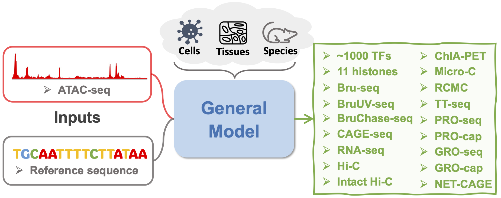

# Developing a general AI model for integrating diverse genomic modalities and comprehensive genomic knowledge 

A [tutorial](https://epcotv2-tutorial.readthedocs.io/en/latest/) for using our model is publicly available. 

Additionally, our model's [web portal](https://huggingface.co/spaces/luosanj/EPCOTv2) is available, where users can easily predict diverse modalities.

